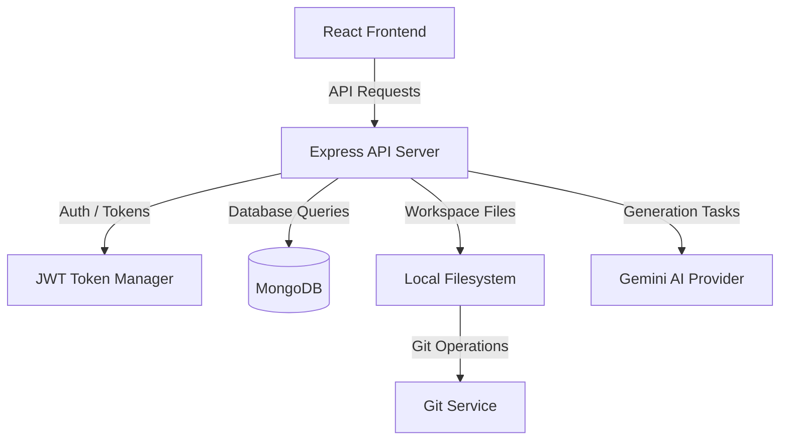

# PromptAI — Collaborative AI Software Engineering Workspace

PromptAI is an intelligent, Git-native AI software engineering assistant and multi-user SaaS workspace. It transforms prompts into fully functional project codebases and allows developer-AI pair programming through incremental source modifications, instant previews, and automated version control tracking.

---

## 🚀 Key Features

### 1. Transparent Git Version Control & Rollbacks
* **Git-Native Architecture**: Every generated workspace is initialized as a Git repository automatically.
* **Auto-Commits**: AI edits trigger automatic commits describing exactly what changed based on structural summaries.
* **Non-Destructive Rollbacks**: Linear histories are preserved. Reverting to previous versions checks out target files and appends a rollback commit, keeping history fully reversible.
* **Manual Edits Blocker**: Warns and prevents AI code overwrites if the local workspace contains uncommitted manual changes.

### 2. Multi-User SaaS Architecture
* **OAuth Security**: Fully protected client/server endpoints using Google OAuth credentials validation.
* **Dual-Token System**: Short-lived Access Tokens (JWT, 15m) paired with secure `HttpOnly` cookie-wrapped Refresh Tokens (7d) featuring rotation protection.
* **Mock Sandbox Access**: Local development fast-login via `mock_` email triggers to bypass Google Client setups.
* **Central Ownership Enforcement**: Centralized middleware rules secure `:projectId` parameters.

### 3. Pair-Programming Chat Engine & Editor
* **Interactive AI Chat**: Refine your project incrementally with context-aware suggestions and line diff checkpoints.
* **Code Sandbox Editor**: Full-featured code editor with syntax highlighting, search, wrap toggle, and download.
* **Integrated Live Preview**: Inspect running web app code with hot reload buttons, responsive width dragging handles, and fullscreen views.

---

## 🛠️ Technology Stack

* **Frontend**: React, React Router, TailwindCSS, Framer Motion, Lucide icons, Sonner notifications, Axios.
* **Backend**: Node.js, Express, MongoDB (Mongoose), `simple-git` version controller, JWT auth, cookie-parser.
* **AI Provider**: Google Gemini API via structured JSON parser validation hooks.

---

## 📂 Architecture Overview



### Server Components
* `models/User.js` & `models/Project.js`: Manage identities and projects versions history.
* `services/GitService.js`: Encapsulates repo setup, commits, status tracking, and rollback operations.
* `services/GenerationService.js`: Coordinates the 12-stage AI pipeline.
* `middleware/auth.js`: Handles session verification and parameter ownership checks.

---

## ⚙️ Installation & Setup

### Prerequisites
* **Node.js**: v18 or later.
* **MongoDB**: A running instance or MongoDB Atlas URL.
* **Git**: Installed and available in the environment path.

### 1. Clone & Set Up Environment
Copy/create the configuration environments files:

**Server Environment (`server/.env`):**
```env
PORT=5000
MONGODB_URI=mongodb://localhost:27017/promptai
JWT_SECRET=super-secret-jwt-key
GOOGLE_CLIENT_ID=google-oauth-client-id
GEMINI_API_KEY=your-gemini-api-key
```

**Client Environment (`client/.env`):**
```env
VITE_GOOGLE_CLIENT_ID=google-oauth-client-id
```

### 2. Install Dependencies
Run in both project roots:
```bash
# Server Setup
cd server
npm install

# Client Setup
cd ../client
npm install
```

### 3. Run Development Servers
```bash
# Start backend (defaults to http://localhost:5000)
cd server
npm run dev

# Start frontend (defaults to http://localhost:5173)
cd client
npm run dev
```

---

## ⚠️ Known Limitations
1. **Local Disk Storage**: Project workspace code is saved on the host filesystem under `server/projects`. Production environments will require virtualized volumes or S3 storage adapters.
2. **Conflict Merging**: Manual conflict merging tools are not exposed yet. Concurrent edits are blocked if the repository is dirty.

---

## 🔮 Future Improvements
* **Branch Merging UI**: Expose branching and merges triggers directly to the user dashboard.
* **Realtime Collaboration**: Enable multi-user workspace editing using CRDTs or WebSocket engines.
* **Billing Tiers**: Upgrade free users to Pro plans with integrated Stripe subscription packages.
